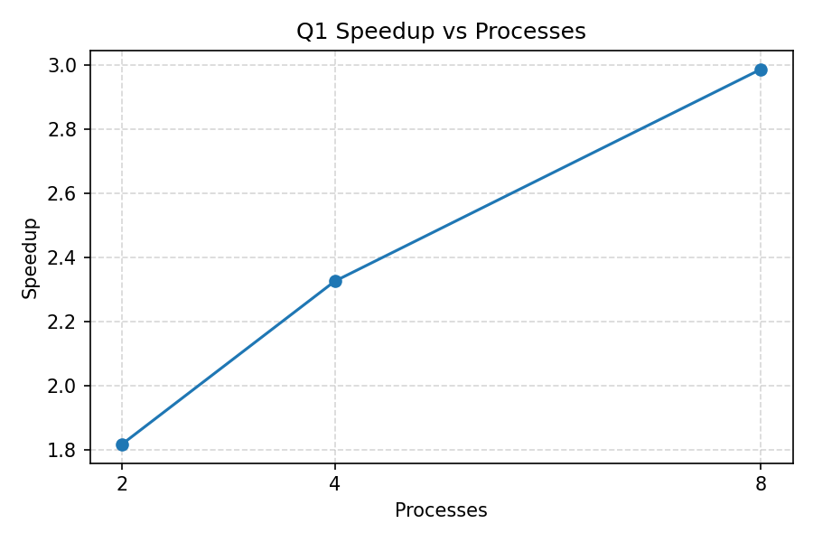
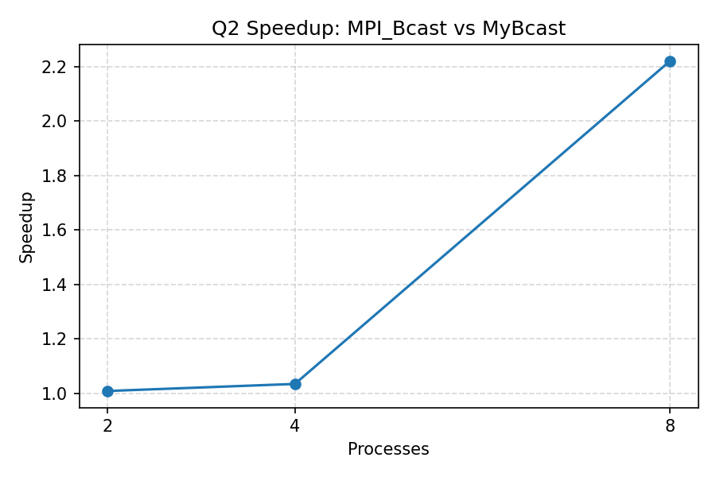
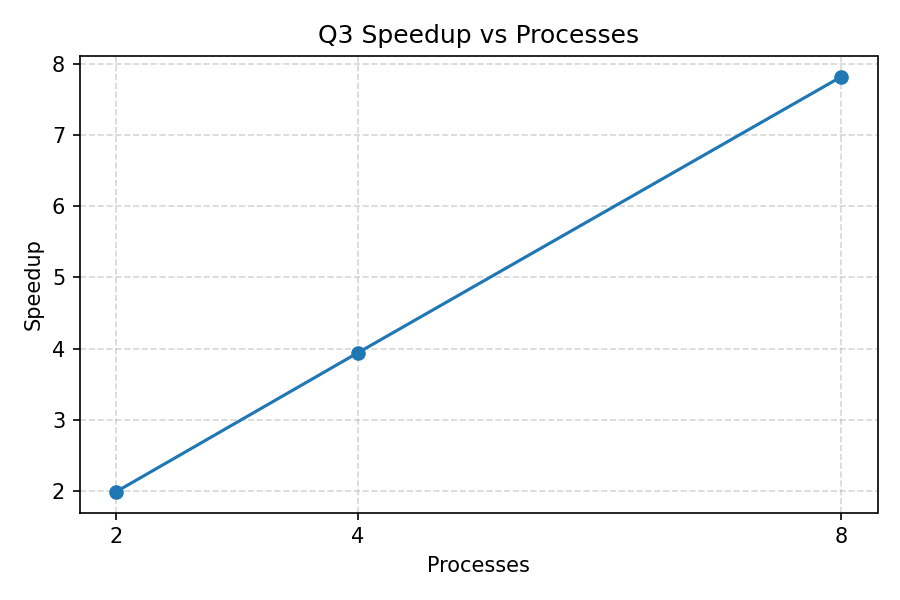

# MPI Assignment 5 Report

# Overview

This report summarizes five MPI exercises that explore how communication patterns and work partitioning affect performance. The focus is on collective operations, point to point messaging, and master worker scheduling.

The tasks covered are: DAXPY vector update, manual broadcast versus MPI_Bcast, distributed dot product with MPI_Bcast and MPI_Reduce, and dynamic work distribution for prime and perfect number detection.

---

# System Configuration

All runs were performed on Linux using the MPI C++ compiler mpicxx. Process counts of 1, 2, 4, and 8 were used where timing data was collected.

---

# Question 1 DAXPY Operation

## Description

DAXPY performs the vector update
X[i] = a multiplied by X[i] plus Y[i]

The MPI version splits the work across ranks and reports time and speedup relative to a single process run.

## Execution Time (Parallel Time)

| Number of Processes | Time in seconds |
| ------------------- | --------------- |
| 1                   | 0.000046707     |
| 2                   | 0.000025698     |
| 4                   | 0.000020068     |
| 8                   | 0.000015630     |

## Speedup Calculation

Speedup is computed as $T_1 / T_N$.

| Number of Processes | Speedup |
| ------------------- | ------- |
| 2                   | 1.818   |
| 4                   | 2.327   |
| 8                   | 2.988   |

## Speedup Graph

## Detailed Analysis

Runtime drops as processes increase, but scaling is not linear because the per rank workload is tiny and the launch and synchronization overheads become dominant.

---

# Question 2 Broadcast Race

## Description

This task contrasts a manual broadcast implemented with repeated MPI_Send calls against MPI_Bcast, which uses an optimized collective algorithm.

## Execution Time

| Number of Processes | Manual Broadcast Time | MPI Broadcast Time |
| ------------------- | --------------------- | ------------------ |
| 2                   | 0.0140819             | 0.0139708          |
| 4                   | 0.0395848             | 0.0382957          |
| 8                   | 0.0926276             | 0.0417282          |

## Speedup Graph (MPI_Bcast vs MyBcast)

Speedup is computed as MyBcast time divided by MPI_Bcast time.

## Detailed Analysis

The manual approach makes rank 0 a bottleneck because it must send to every rank sequentially. MPI_Bcast avoids this linear bottleneck by forwarding data in a tree, which reduces the number of steps as process count grows.

---

# Question 3 Distributed Dot Product and Amdahl Law

## Description

Each process generates its local chunk of two vectors, computes a partial dot product, and MPI_Reduce combines the partial sums. A multiplier is broadcast from rank 0 before the local computation starts.

## Execution Time

| Number of Processes | Time in seconds |
| ------------------- | --------------- |
| 1                   | 0.336493        |
| 2                   | 0.168988        |
| 4                   | 0.085377        |
| 8                   | 0.0430554       |

## Speedup

| Number of Processes | Speedup |
| ------------------- | ------- |
| 2                   | 1.991   |
| 4                   | 3.941   |
| 8                   | 7.815   |

## Speedup Graph

## Efficiency

| Number of Processes | Efficiency |
| ------------------- | ---------- |
| 2                   | 0.996      |
| 4                   | 0.985      |
| 8                   | 0.977      |

## Detailed Analysis

Speedup is strong across all runs, but not perfectly linear because there is still a fixed cost for the broadcast, the reduction, and process synchronization. This matches the Amdahl Law expectation that non parallel work limits overall scaling.

---

# Question 4 Prime Number Computation

## Description

The prime finder uses a master worker scheme where workers request candidates, test for primality, and return the result to the master.

## Output

The program correctly identifies all prime numbers up to 100.

## Speedup Graph

Speedup is not shown because only correctness output was collected for this task.

## Detailed Analysis

Dynamic task assignment keeps workers busy and avoids idle time that can happen with static chunking, especially when per number work is uneven.

---

# Question 5 Perfect Number Computation

## Description

This task mirrors the prime worker model but checks whether a number equals the sum of its proper divisors.

## Output

The program identifies the following perfect numbers up to 10000

6, 28, 496, 8128

## Speedup Graph

Speedup is not shown because only correctness output was collected for this task.

## Detailed Analysis

Checking perfect numbers is heavier than primality testing, and the master worker pattern helps distribute that cost evenly. Since valid results are rare, the output is small but the computation is significant.

---

# Final Conclusion

These experiments show the benefit of MPI parallelism alongside its limitations. Collective operations like MPI_Bcast scale better than naive point to point loops, and master worker scheduling improves utilization for irregular workloads.

Even with good parallel structure, synchronization and communication overheads cap the achievable speedup, which is consistent with Amdahl Law.

