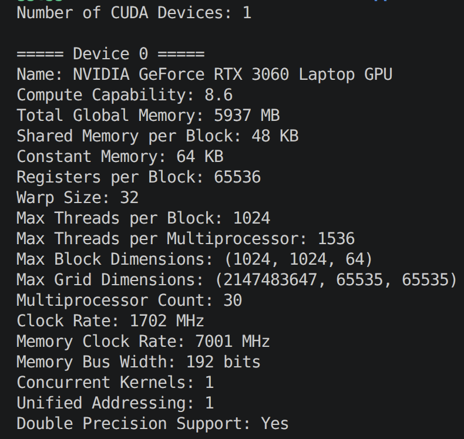
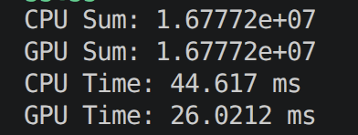
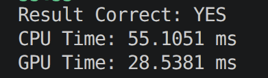

# Assignment 6: Introduction to CUDA

## Overview
- Device query to report GPU properties
- Array sum using CUDA reduction
- Matrix addition using CUDA

---

## Part A: Device Query

### GPU Details
- GPU Name: NVIDIA GeForce RTX 3060 Laptop GPU
- Architecture: Ampere
- Compute Capability: 8.6

### Block and Grid Limits
- Max Threads per Block: 1024
- Max Block Dimensions: 1024 x 1024 x 64
- Max Grid Dimensions: 2147483647 x 65535 x 65535

### Memory Details
- Global Memory: 5937 MB
- Shared Memory per Block: 48 KB
- Constant Memory: 64 KB

### Other Properties
- Warp Size: 32
- Multiprocessors: 30
- Max Threads per Multiprocessor: 1536
- Double Precision Support: Yes

### Answers

1. Architecture and compute capability
   - Ampere, Compute Capability 8.6

2. Maximum block dimensions
   - 1024 x 1024 x 64

3. Maximum threads for 1D grid/block
   - Max threads = 65535 x 512 = 33,553,920

4. When not to launch the maximum threads
   - To avoid resource waste, contention, or reduced occupancy
   - When the problem size is smaller than max launch parameters

5. What can limit maximum threads
   - Shared memory and register limits
   - Maximum threads per block and per SM
   - Kernel design and occupancy constraints

6. Shared memory
   - On-chip memory shared by threads in a block
   - 48 KB per block on this GPU

7. Global memory
   - Large off-chip memory accessible by all threads
   - 5937 MB on this GPU

8. Constant memory
   - Read-only cached memory for uniform access
   - 64 KB on this GPU

9. Warp size
   - Threads executed together as a scheduling unit
   - 32 on this GPU

10. Double precision support
   - Yes

### Screenshot

---

## Part B: Array Sum

### Input
- Array Size: 1 << 24 (16,777,216 elements)
- Block Size: 256 threads
- Grid Size: 65,536 blocks

### Results
- CPU Sum: 1.67772e+07
- GPU Sum: 1.67772e+07
- CPU Time: 45.6363 ms
- GPU Time: 0.851282 ms
- Speedup: 53.6x (CPU/GPU)

### Observations
- GPU is faster here because the array is large and the reduction uses shared memory
- Transfer overhead exists, but kernel time dominates at this input size
- Further speedups may require multi-stage reductions or using CUB

### Screenshot

---

## Part C: Matrix Addition

### Input
- Matrix Size: 4096 x 4096
- Block Size: 16 x 16
- Grid Size: 256 x 256

### Kernel Metrics
- Total Elements: 16,777,216
- FLOPs: 1 add per element = 16,777,216
- Global Memory Reads: 2 per element = 33,554,432
- Global Memory Writes: 1 per element = 16,777,216

### Results
- Result Correct: YES
- CPU Time: 55.7104 ms
- GPU Time: 1.10657 ms
- Sample Output: 3

### Observations
- Matrix addition is memory bound: one add per two reads and one write
- Coalesced access helps, but global memory bandwidth dominates
- Larger matrices benefit more from GPU parallelism

### Screenshot

---

