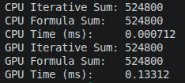
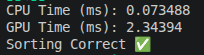
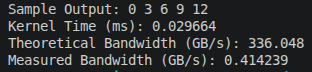
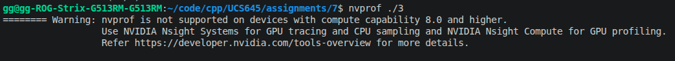

# Assignment 7: 

## Overview
- Sum of first N integers (iterative vs formula) on CPU and GPU
- Parallel merge sort (pipelining vs CUDA)
- Vector addition with timing and bandwidth analysis

---

## Part A: Sum of First N Integers (N = 1024)

### Task
- Compute sum using iterative approach
- Compute sum using direct formula
- Run both on CPU and GPU

### Results
```
CPU Iterative Sum: 524800
CPU Formula Sum:   524800
CPU Time (ms):     0.001072
GPU Iterative Sum: 524800
GPU Formula Sum:   524800
GPU Time (ms):     0.169984
```

### Answers
- Expected sum is $N(N+1)/2 = 1024 * 1025 / 2 = 524800$, which matches CPU and GPU
- Iterative and formula approaches produce identical results

### Observations
- CPU is faster for this small $N$ due to kernel launch and memory overhead on GPU

### Screenshot



---

## Part B: Merge Sort (n = 1000)

### Task
- Implement merge sort with pipelining (CPU-side parallelization)
- Implement parallel merge sort using CUDA
- Compare performance

### Results
```
CPU Time (ms): 0.113423
GPU Time (ms): 2.29069
Sorting Correct ✅
```

### Answers
- Sorting is correct based on program verification
- CPU pipelined version is faster for $n=1000$

### Observations
- For small arrays, GPU overhead outweighs parallel speedup
- CUDA performance should improve at larger input sizes

### Screenshot



---

## Part C: Vector Addition + Bandwidth

### Task
- Use statically defined global device memory (no `cudaMalloc`)
- Record kernel timing
- Query device properties to compute theoretical bandwidth
- Compute measured bandwidth from read/write bytes and kernel time

### Results
```
Sample Output: 0 3 6 9 12 
Kernel Time (ms): 0.037568
Theoretical Bandwidth (GB/s): 336.048
Measured Bandwidth (GB/s): 0.327087
```

### Answers
- Vector addition is correct for sample output
- Theoretical bandwidth uses device properties and DDR factor
- Measured bandwidth uses $\text{measuredBW} = (RBytes + WBytes) / t$

### Observations
- Measured bandwidth is far below theoretical due to small workload and launch overhead

### Screenshot



### Profiler Note


