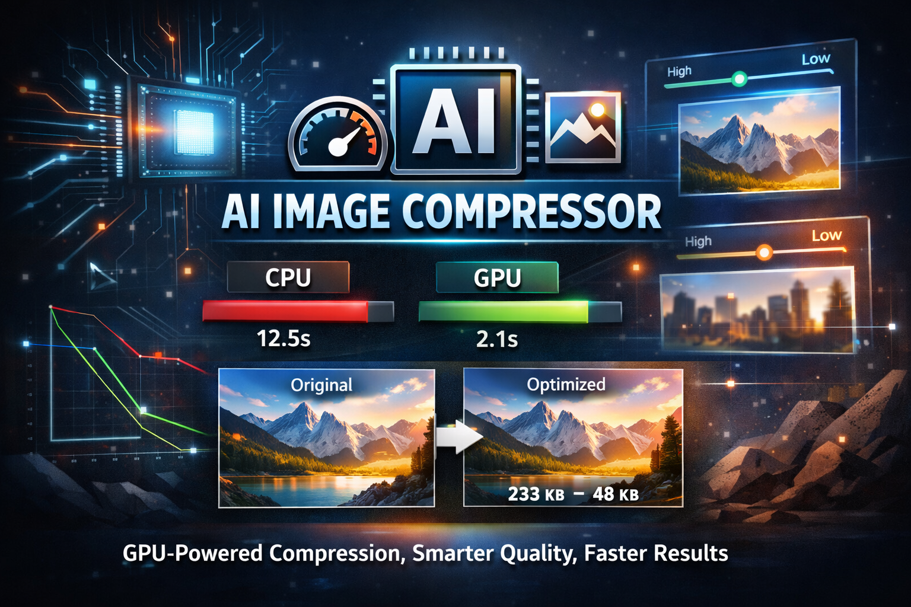

<p align="center">
  
</p>

# img-compressor

A high-performance JPEG compressor written in C++ and CUDA, with both GPU and CPU paths.

In addition to standard quality-based compression, the tool supports content-aware quality mapping that preserves detail in perceptually important regions while applying stronger compression elsewhere.

## Features

- GPU-accelerated image compression (CUDA)
- CPU comparison mode (`--compare`)
- Global quality control (`--quality`)
- Content-aware quality mapping (`--quality-map`)
- Optional debug outputs for saliency map inspection

## Linux Requirements

- Linux with CMake 3.18+
- C++ toolchain (`g++`, `make`)
- CUDA toolkit (optional, for GPU path)
- `libjpeg-dev`

Install dependencies on Debian/Ubuntu:

```bash
sudo apt update
sudo apt install -y build-essential cmake libjpeg-dev
```

## Build (Linux)

```bash
./build.sh
```

This creates the executable at `build/img-compressor`.

## Run

Baseline run:

```bash
./build/img-compressor --input tests/data/img-test.png --output tests/artifacts/out.jpg --quality 85 --compare
```

Content-aware quality map with debug outputs:

```bash
./build/img-compressor --input tests/data/img-test.png --output tests/artifacts/out.jpg --quality 85 --compare --quality-map --quality-map-debug tests/artifacts
```

Useful flags:

- `--quality-map`
- `--quality-map-strength <0..1>`
- `--quality-map-min-scale`
- `--quality-map-max-scale`
- `--quality-map-debug <dir>`

If a CUDA-capable GPU is unavailable, the CPU path still runs.
